# Tutorial

This lab will use the [COVID data set](https://www.kaggle.com/fireballbyedimyrnmom/us-counties-covid-19-dataset) to demonstrate data profiling, data visualization, and data preparation capabilities of the Data Refinery tool.  The lab consists of the following steps:

## Steps

1. [Create Watson Studio service on IBM Cloud](#1-create-watson-studio-service-on-IBM-cloud)
2. [Create a project in Watson Studio and upload the data](#2-create-a-project-in-Watson-Studio-and-upload-the-data)
3. [Use the Data Refinery Tool](#3-use-the-data-refinery-tool)
    * Profile the data to help determine missing values
    * Visualize the data to gain a better understanding
    * Prepare the data for modeling
    * Run the sequence of data preparation operations on the entire data set.

### 1. Create Watson Studio service on IBM Cloud

The first step in this tutorial is to set up your IBM Cloud [Watson Studio service](https://cloud.ibm.com/catalog/services/watson-studio). See the video below to help you create your free
IBM Watson Studio service.

* After logging into IBM Cloud, click `Proceed` to show that you have read your data rights.

* Click on `IBM Cloud` in the top left corner to ensure you are on the home page.

* Within your IBM Cloud account, click on the top search bar to search for cloud services and offerings. Type in `Watson Studio` and then click on `Watson Studio` under `Catalog Results`.

* This takes you to the Watson Studio service page. There you can name the service as you wish. For example, one may name it
`Watson-Studio-trial`. You can also choose which data center to create your instance in. The gif above shows mine as
being created in Dallas.

* For this guide, you choose the `Lite` service, which is no-charge. This has limited compute; it is enough
to understand the main functionality of the service.

* Once you are satisfied with your service name, and location, and plan, click on create in the bottom-right corner. This creates your Watson Studio instance.

### 2.Create a project in Watson Studio and upload the data

* To launch your Watson Studio service, go back to the home page by clicking on `IBM Cloud` in the top-left corner. There you see your services, and under there you should see your service name. This might take a minute or two to update.

* Once you see your service that you just created, click on your service name, and this takes you to your
Watson Studio instance page, which says `Welcome to Watson Studio. Let's get started!`. Click on the `Get Started` button.

* This takes you to the Watson Studio tooling. There you see a heading that says `Start by creating a project` and a button that says `Create Project`. Click on `Create a Project`. Next click on `Create an Empty project`.

* On the create a new project page, name your project. One may name the project - `emergencyresponse`. You also need to associate an IBM Cloud Object store instance, so that you store the data set.

* Under `Select Storage service` click on the `Add` button. This takes you to the IBM Cloud Object Store service page. Leave the service on the `Lite` tier and then click the `Create` button at the bottom of the page. You are prompted to name the service and choose the resource group. Once you select a name, click the resource group `Confirm` button.

* Once you've confirmed your IBM Cloud Object Store instance, you are taken back to the project page. Click on `refresh` and you should see your newly created Cloud Object Store instance under `Storage`. That's it! Now you can click `Create` at the bottom right of the page to create your first IBM Watson Studio project :)

* Once you have created your Watson Studio Project, you see a blue `Add to Project` button on the top-right corner of your screen.

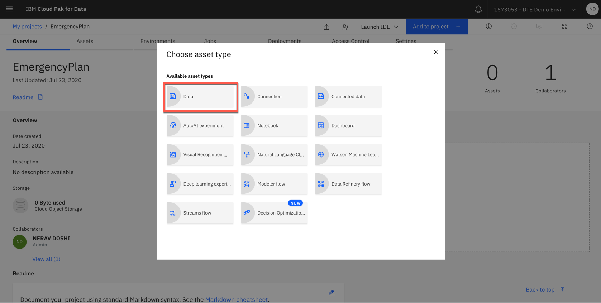

* Select `Data`.

* On the right-hand side bar, click on `browse` and then go to where you cloned the repository, and select `us-counties.csv`.

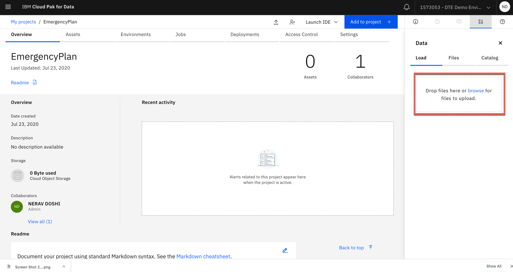

* Once the upload has finished, you should see it under data asset of the project

### 3. Use the Data refinery tool
* Click three dots on uploaded data and click `Refine`.

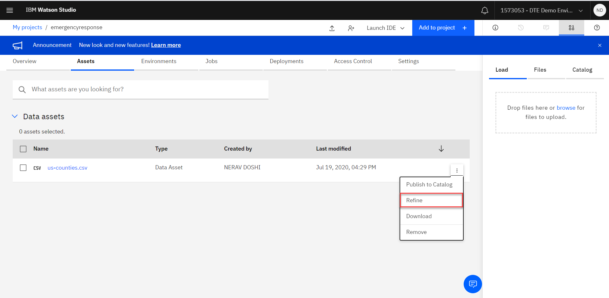

* The Data Refinery panel will display the us county Covid-19 data set. Click on the `Profile`. tab.  

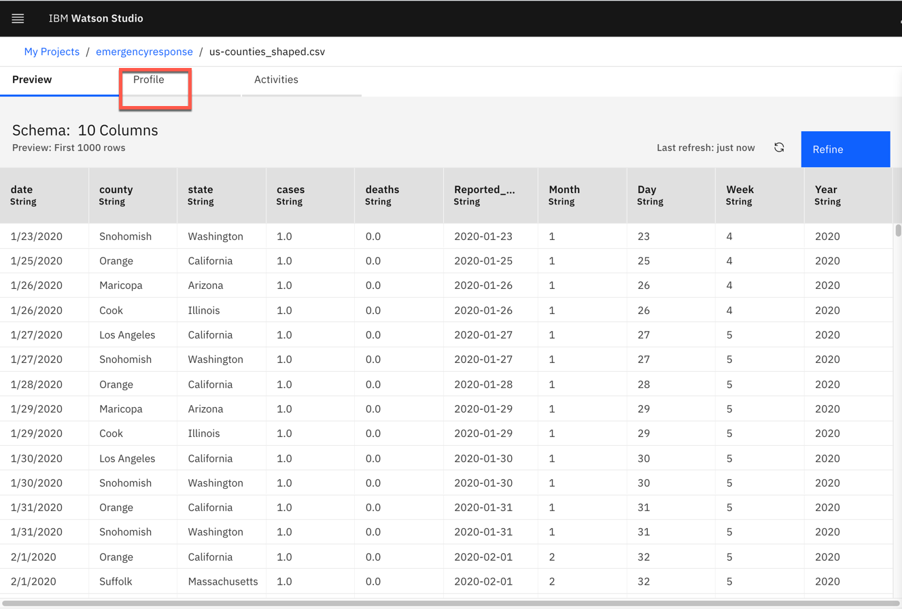

* The Profile panel displays the counts of the top 10 count values for each column. Note that you can change 10 to another number if desired. You can also switch to the bottom 10 counts for a column. Scroll to the right to view the all column

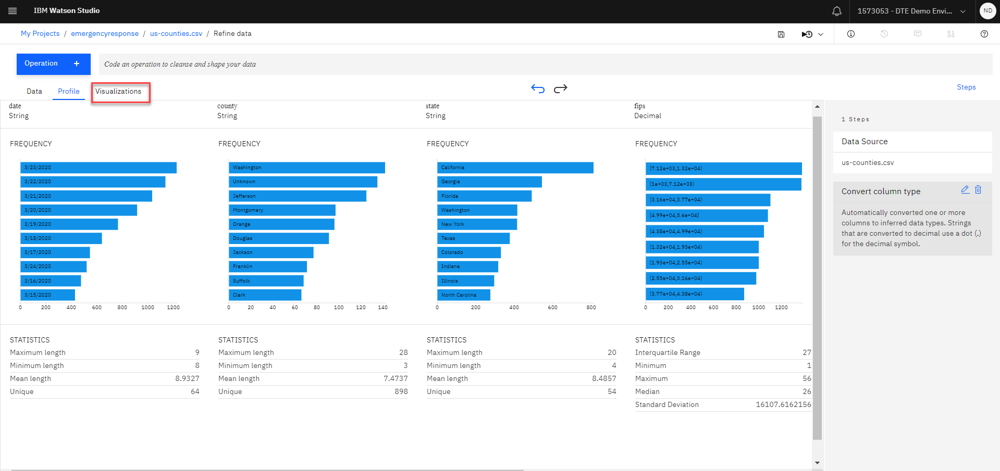

* Note that the flips column has a specific code for counties, this may vary for metro areas and should be removed as part of the data preparation step.  

* Data Understanding - Click on `Vizualizations`. tab
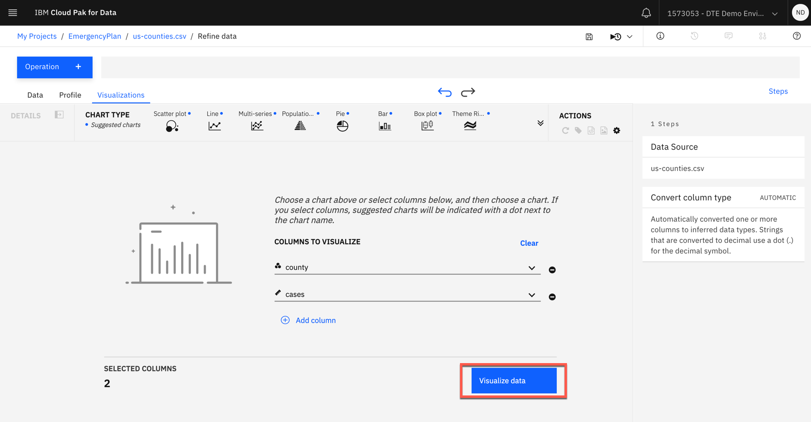

* Let’s take a look at the breakdown of counties and cases. Add cases and county
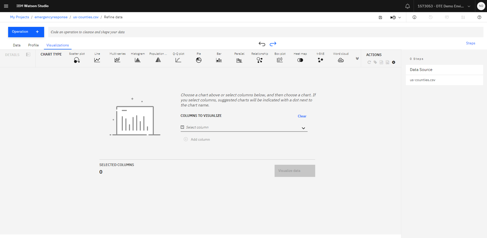

* It will automatically pick a chart type based on columns chosen and show the chart

* On the left side pick column named cases under size and you will see a preview of the chart with counties with cases based on total count of cases Th chart will show the size size of dot and scale of the dots on right hand side

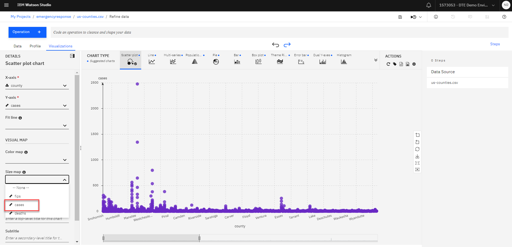

* Click on `Dual Y axis`. to change the chart type.
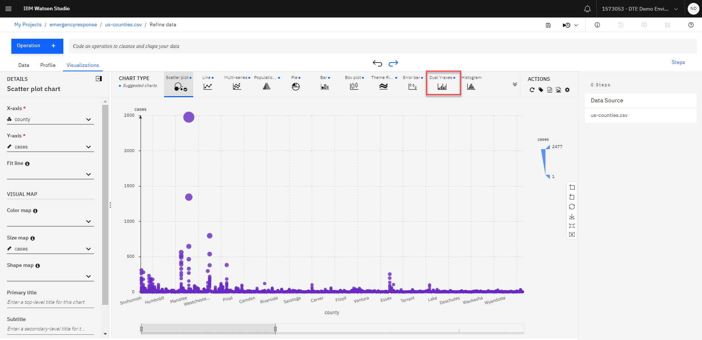

* You can see the cases with bar and line for mean of cases
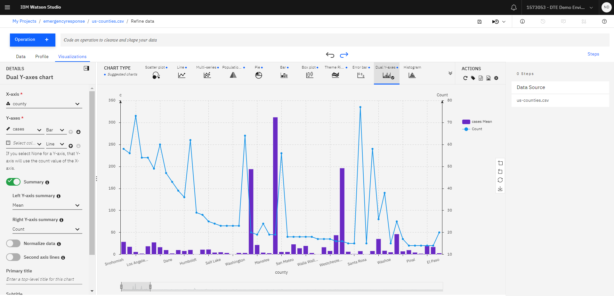

### 4. Prepare the data for modeling
Based on the data analysis, we need to do the following to prepare the data for modeling.   
* Remove columns fips
* Convert column type and create a new column for date

*  Return to the Data panel by clicking on the `Data`. tab.Remove the fips column by selecting on the vertical ellipse and then clicking on `Remove`.
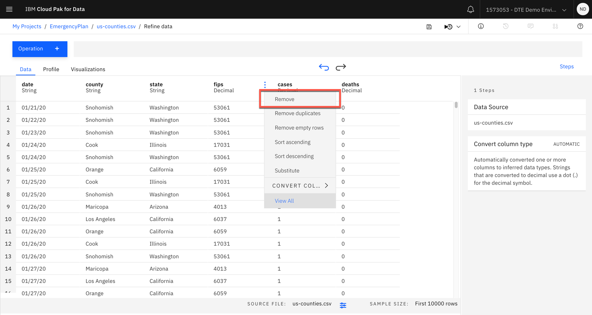

* Convert the date column from a String to a Date. Click `Operations` click on Convert `Column type`., and then check Automatically convert column and select the type to date from the dropdown menu for date and then select `MDY`. format. Click `Apply`.

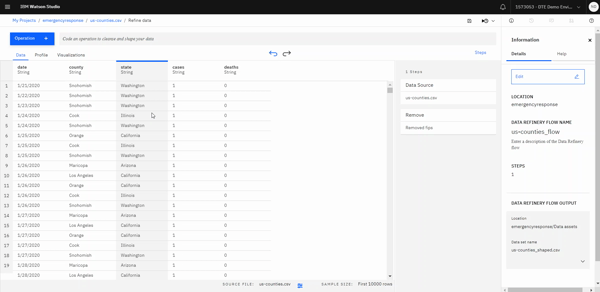

* Convert the date column from a String to a Date. Click `Operations` click the `Extract data and time value`. and then select `Month`. from the dropdown menu  Click `Apply`.

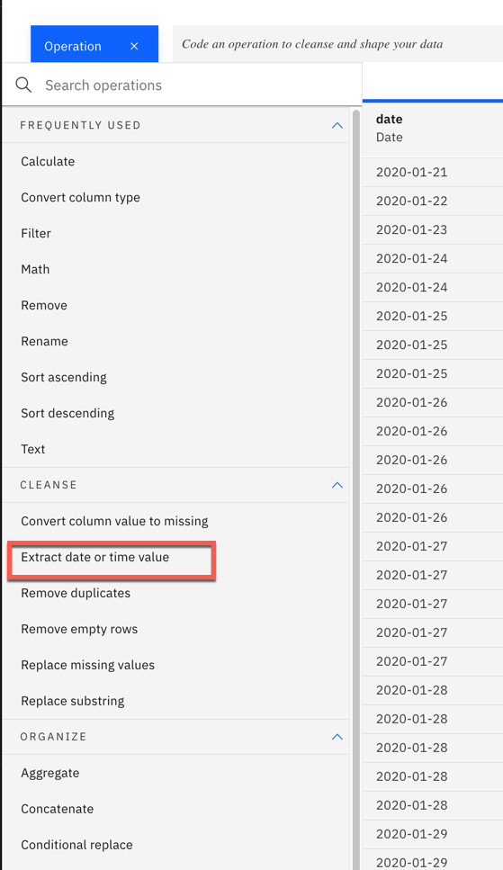
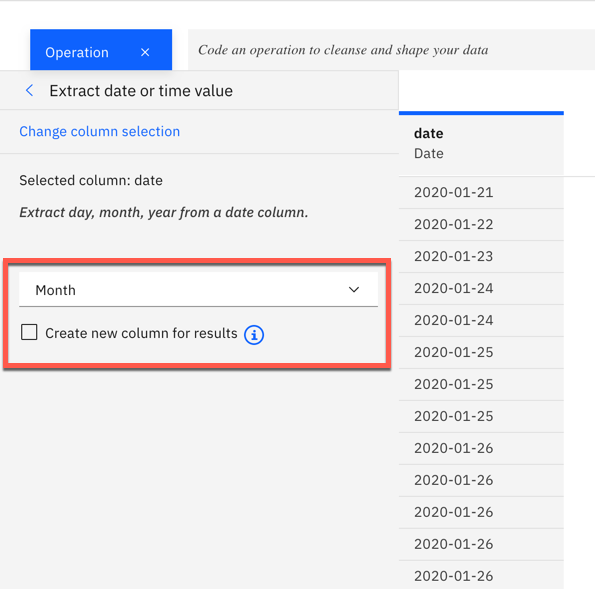

* Repeat above step to create a column for `Day`

* Repeat above step to create a column for `Year`

* Repeat above step to create a column for `Week`

*  Notice the STEPS panel on the right-hand side that provides a running list of the data operations.  Save the Data Flow by clicking on the Save Data Flow icon.
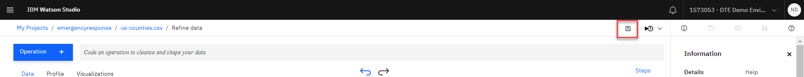

### 5. Run the sequence of Data Flow operations on the entire data set.  
* When users are interacting with the Data Refinery tool, the operations are applied to a subset of the data set to facilitate faster response times. To run the data operations on the entire data set, the user selects the Jobs icon.Selecting the Jobs icon, results in a drop down, select Save and create a job
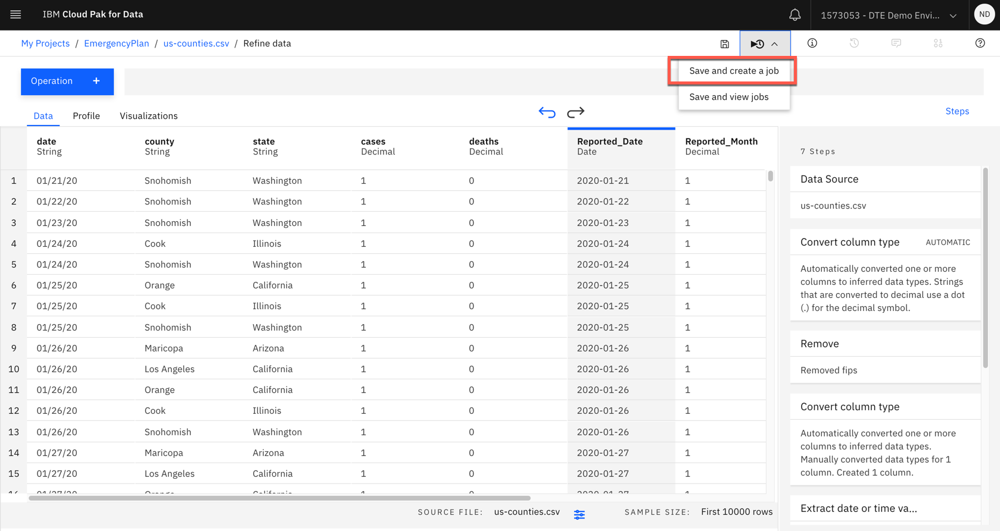

* This action results in the following page display. Fill in the Job Name, for example uscounty_flow_job, leave the default for runtime, and click on the Create and Run button to run the job.
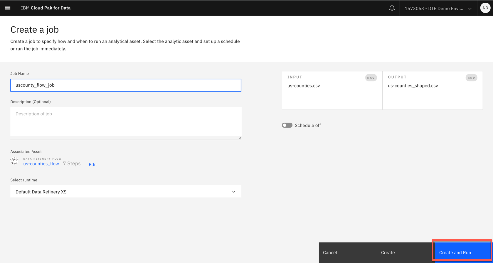

* The output of the Data Refinery process should be listed in the Data Assets. Click on emergencyresponse

* The asset contents are displayed below. Review to confirm that the data transformations specified have been applied to all the data.
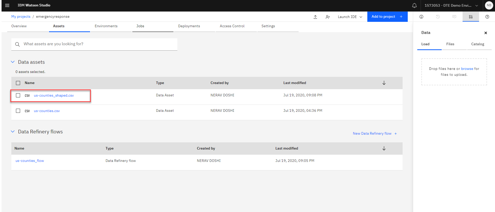
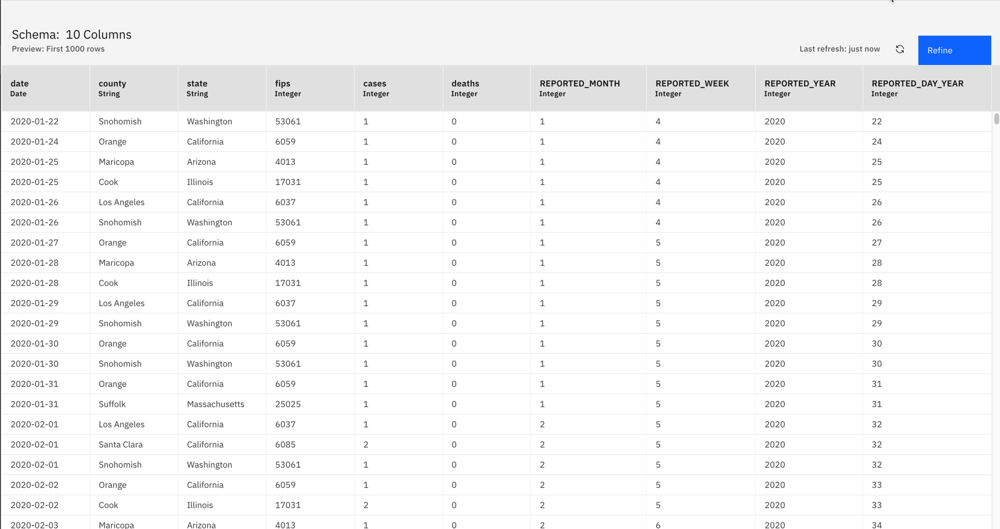

## Summary
You have completed the Lab !!!                  
   ✓ Profiled the data to help determine missing values

   ✓ Visualized the data to gain a better understanding  

   ✓ Prepared the data for modeling

   ✓ Ran the sequence of data preparation operations on the entire data set

   ✓ Verified the output data asset.  
