# Use SPSS Modeler to predict PPE equipment based on COVID-19 data for Michigan counties
In this part of the solution, we will work on predicting future demand of PPE products to help us determine inventory level using SPSS Modeler for Watson Studio on IBM Cloud. SPSS Modeler is a data mining and analytics software
that is used to build predictive models. Using SPSS Modeler for Watson Studio enables data scientists and data analysts to work in a collaborative, cloud-based environment and quickly share their models and results with
their stakeholders.

## Learning objectives
After completing this tutorial, the user will learn:
* How to create an SPSS Modeler flow
* How to use the SPSS tool to profile and analyze data
* How to modify, filter, and prepare data for AI Model creation
* How to create model with SPSS and evaluate the results

## Estimated Time
Completing this tutorial should take about 30 minutes.

## Step

1. [Add a Modeler Flow to your Watson Studio Project](#1-Add-a-modeler-flow-to-your-watson-studio-project)
2. [Import the data](#2-import-the-data)
3. [Data preparation](#4-data-exploration)
4. [Train the ML model](#5-Train-the-ML-model)
5. [Evaluate the results ](#6-Evaluate-the-results)

### 1. Add a Modeler Flow to your Watson Studio Project

* Click on your newly created project.

* Once you have created your Watson Studio Project, you see a blue `Add to Project` button on the top-right corner of your screen.

* Click the `Modeler Flow`.

* Next, select `From File` and `browse` to where you cloned this repository. Select the `COVID_forecast.str` file. Next, click `Create`.

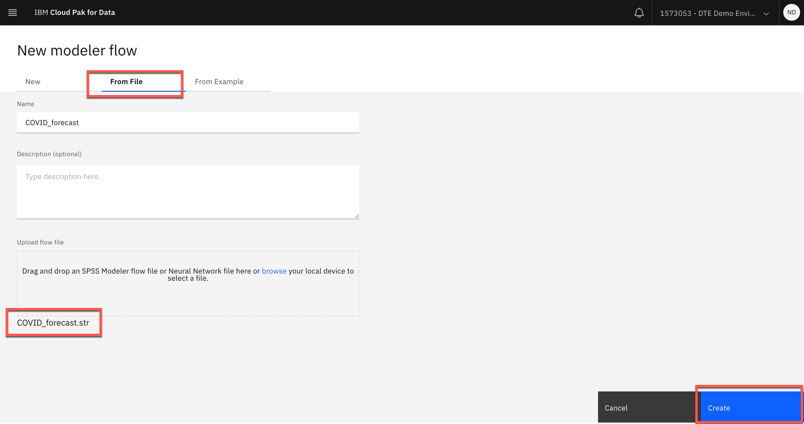

### 2. Import the data

* Right-click the first node which says `us-counties_shaped.csv`. Click `Open`

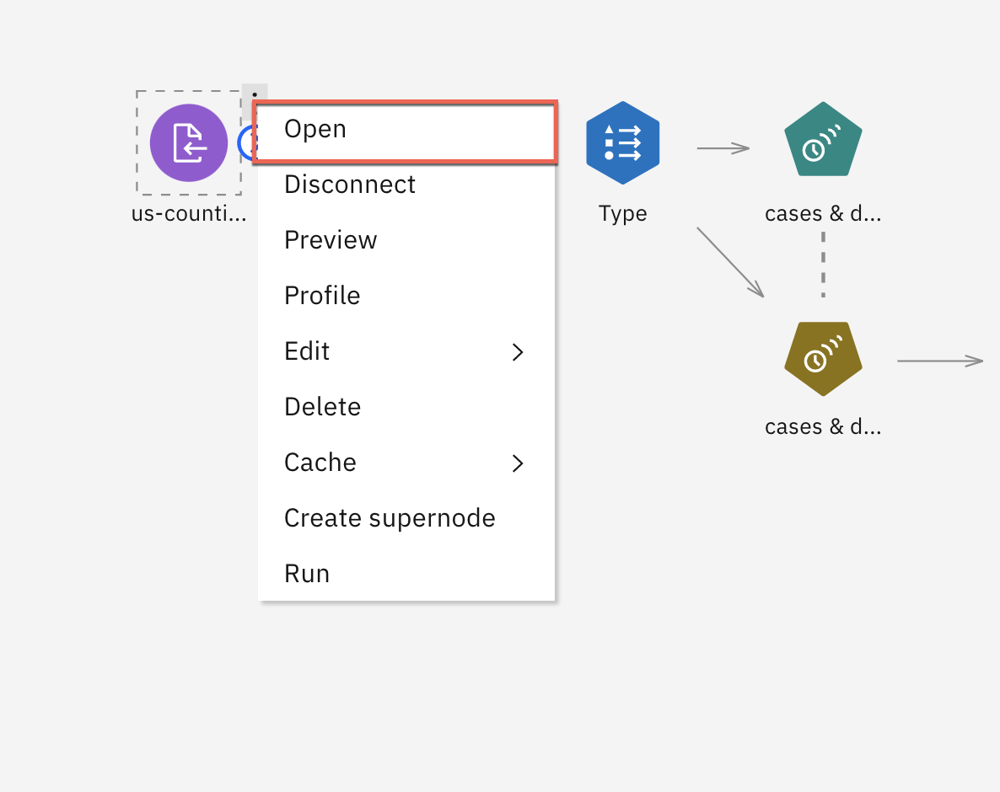

* Click the `Data Assets` and then choose the `us_counties_shaped.csv` file, which contains our COVID data from our part1. Next, click `OK`. Click `Save` on the right side of node pane

### 3. Data preparation
Next, we will focus on the data prep nodes. These are the nodes
which will modify our data set to predict just the values we want. A great way to understand what each node is
doing is to `Preview` the node.

* To preview a node, such as the `us-us_counties_shaped` node, hover over the node, and click on the three-dot symbol.

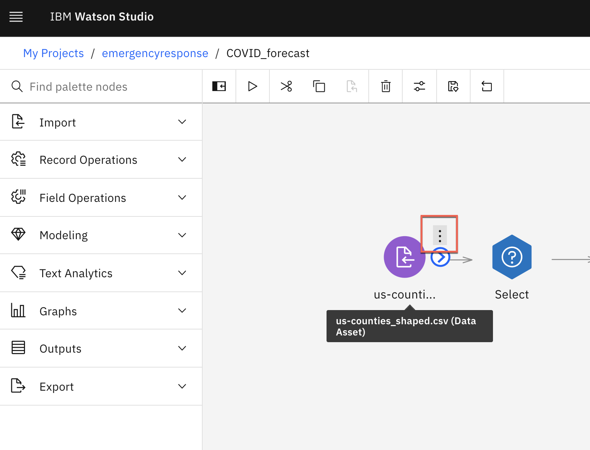

* Next, click on `Preview`.

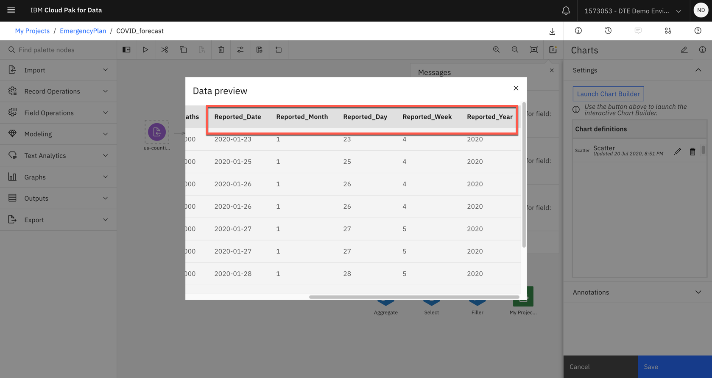

* This is a quick and easy way to see what the data looks like at the current node in the flow. Below is what you should see
once you've previewed the node.

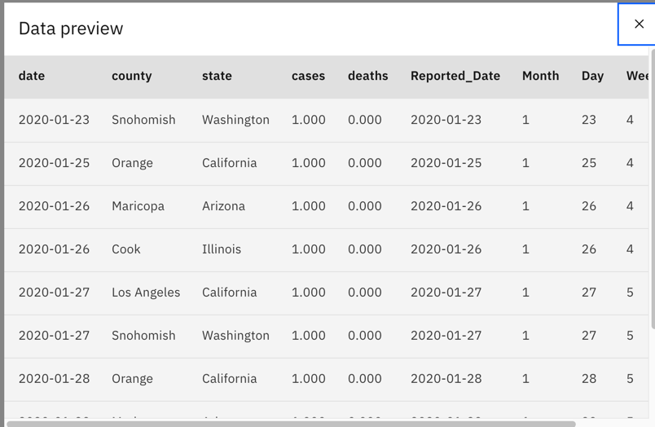

* Hover over the `Date` node, click on the `Three-dot` symbol,
and then on `Preview`.

* Once you preview the node, you should see that the Date node adds another column to the data set, called
`Date` and derives that value from the `Reported_Date` column.

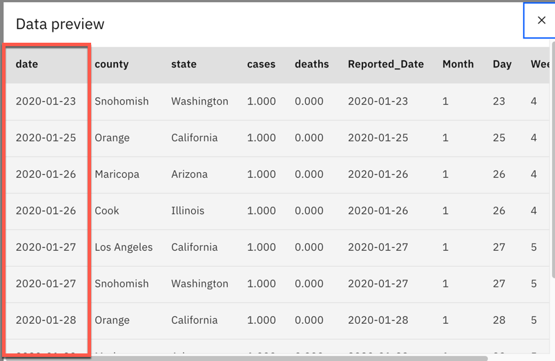

*

* Next, the `Select` node is very important. It's going to take a subset of the data, and it will use an expression to do so. You can
see in the expression, we have only taken the `Michigan` state counties.

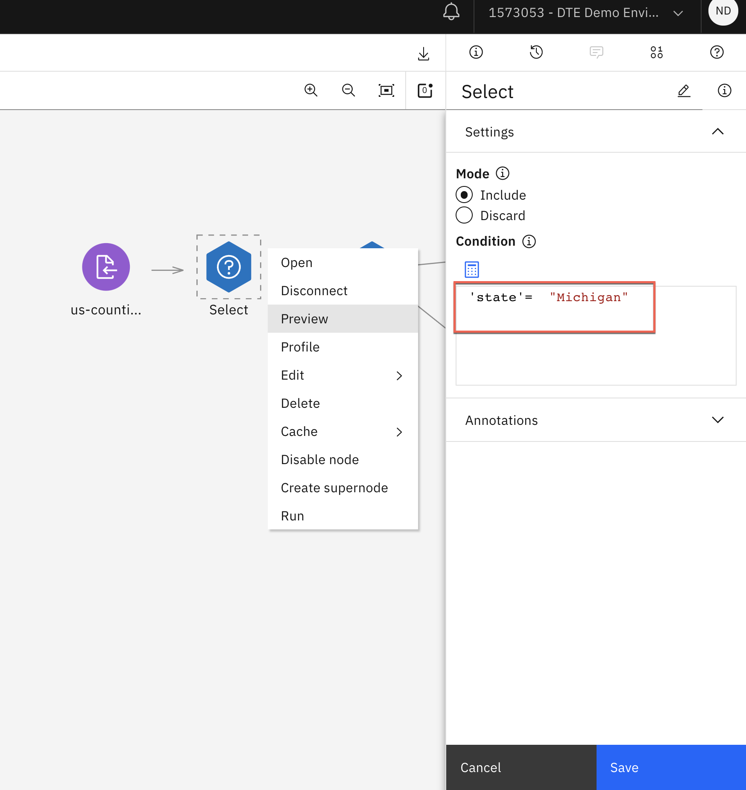

* The last of the data prep nodes is the `Type` node. This enables us to make specific operations on the fields within our data set. In
this node, we split the `Counties` column into individual values, so that we can later predict cases
for each of our products within that column.

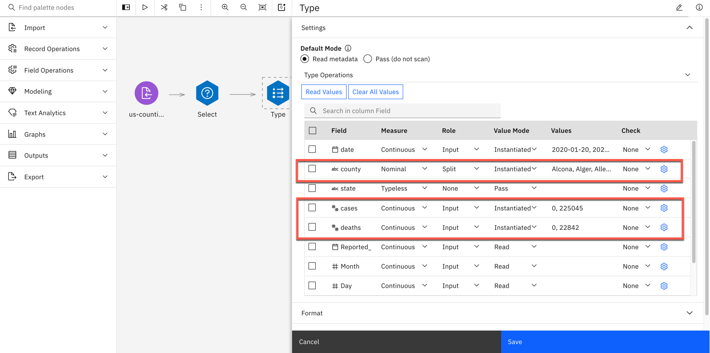

### 4. Train the ML model

* Right-click over the `cases & death` green nugget and then click `Open`.
This will run the time-forecasting model with the data we have
prepared in the previous steps. In the Model section select 5 days as we need to forecast for 5 days from the historic last date

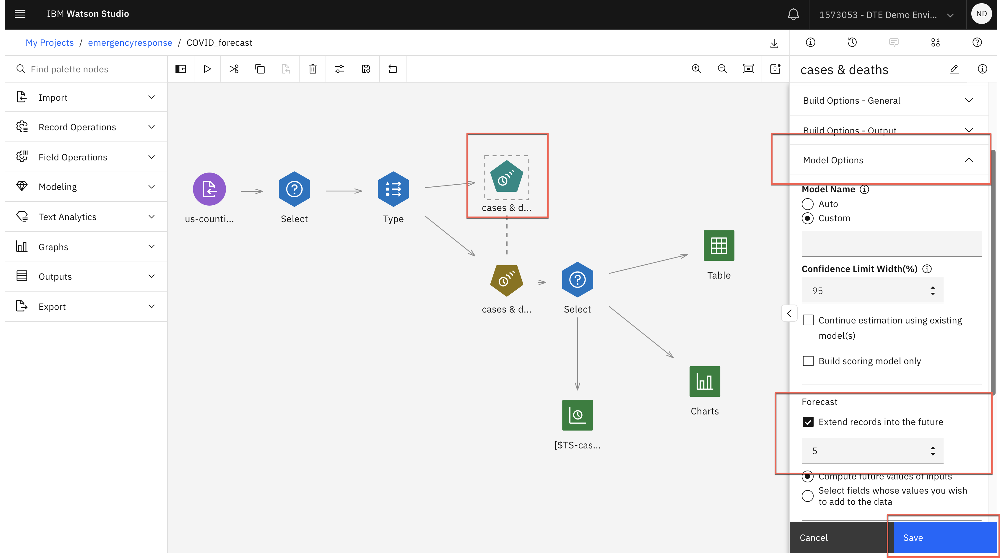

* Click run button Once the model has finished running, you will see the Outputs tab has been updated.

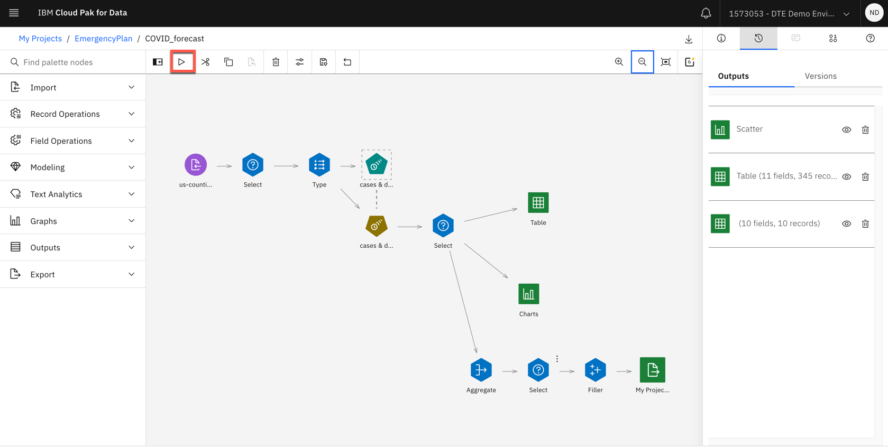
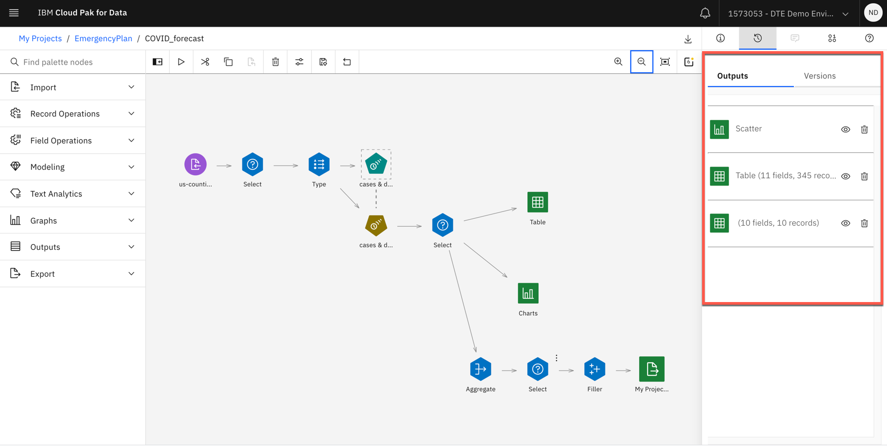

### 5. Evaluate the results

* Click the `Scatter` in the Outputs tab.
You can see project number of cases by counties for next 5 days is ploted. This is based on historical recorded training period i.e. 2020 daily data.

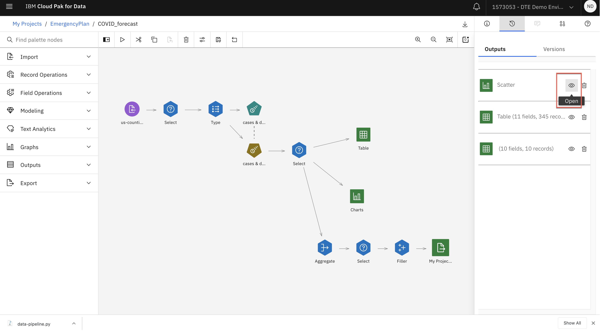
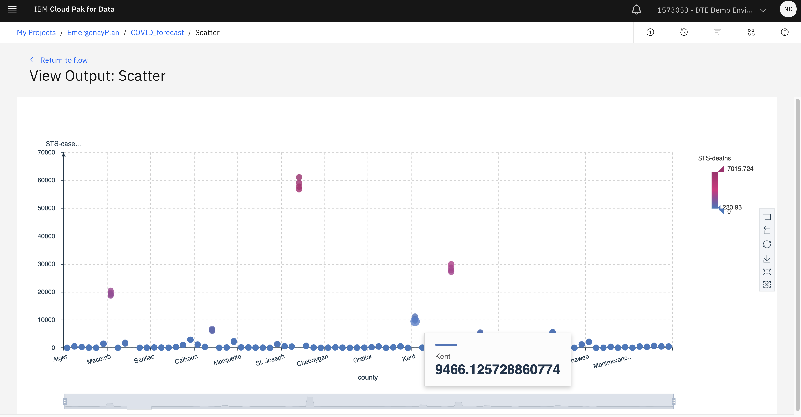

* Right-click on golden node `cases & death` in the stream.
Here you will see model details, modeling method and metrics for each county
charts.

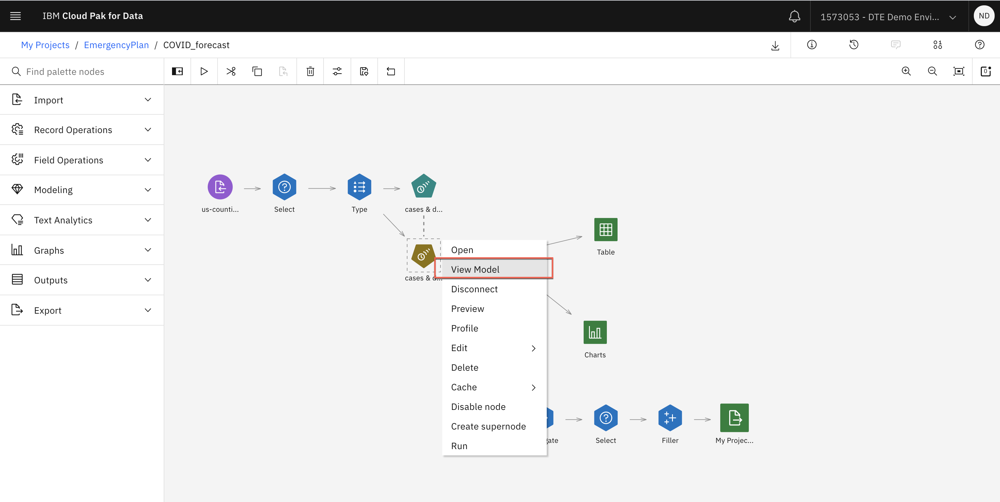
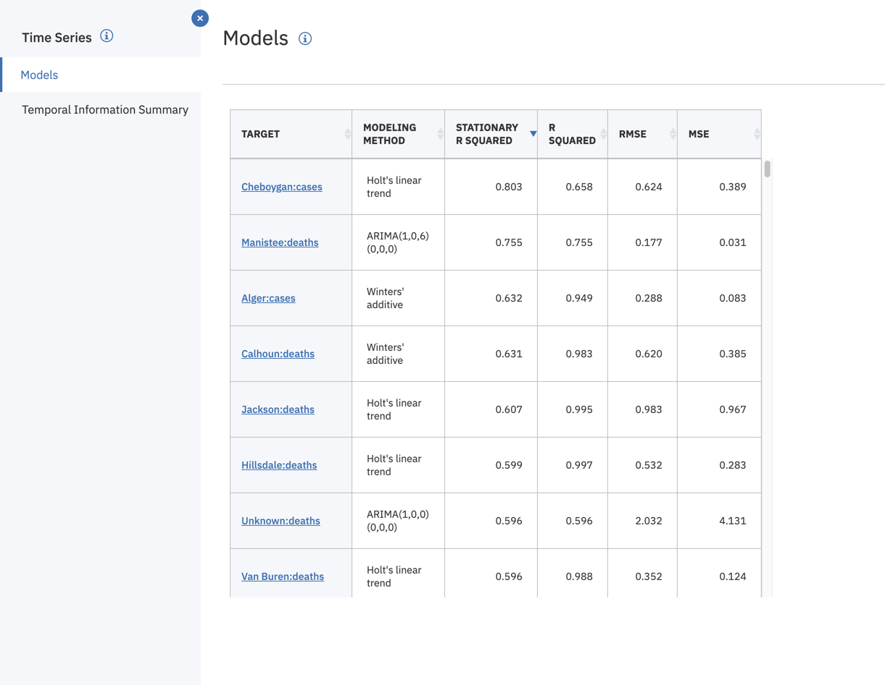

### Summary

This tutorial demonstrates a small example of creating a predictive machine learning model on IBM SPSS Modeler on Watson Studio and IBM SPSS Modeler software. The tutorial goes over on importing the data into the project and the modeler flow, and preparing the data for modeling. The tutorial then goes over the running a time series algorithm for the data and training a prediction model. The last step of the tutorial is about how to visualize and evaluate the results of the trained model.
