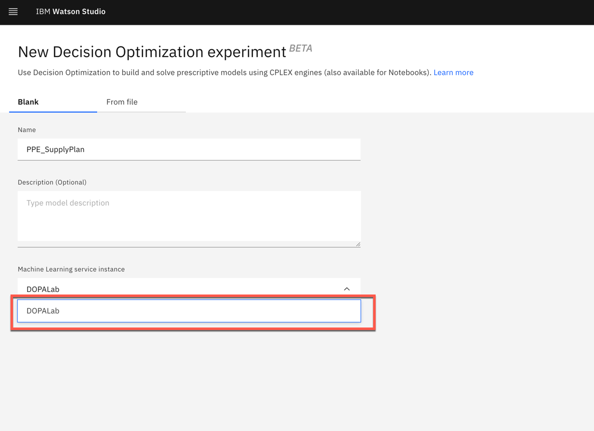
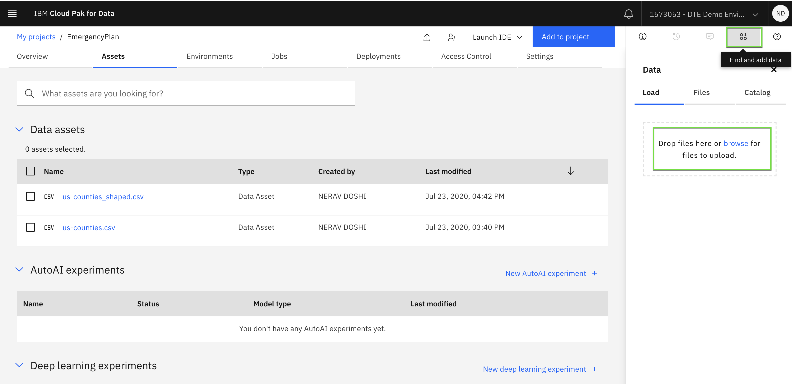
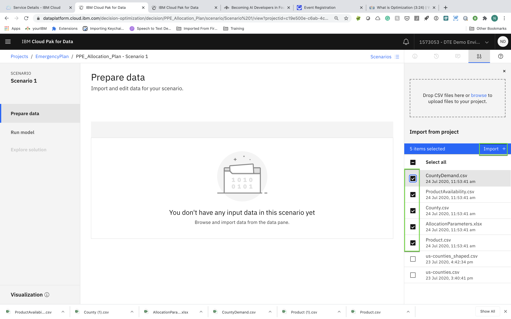
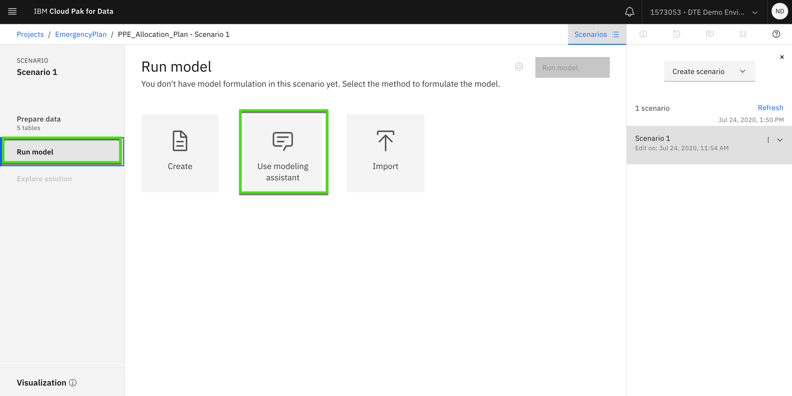
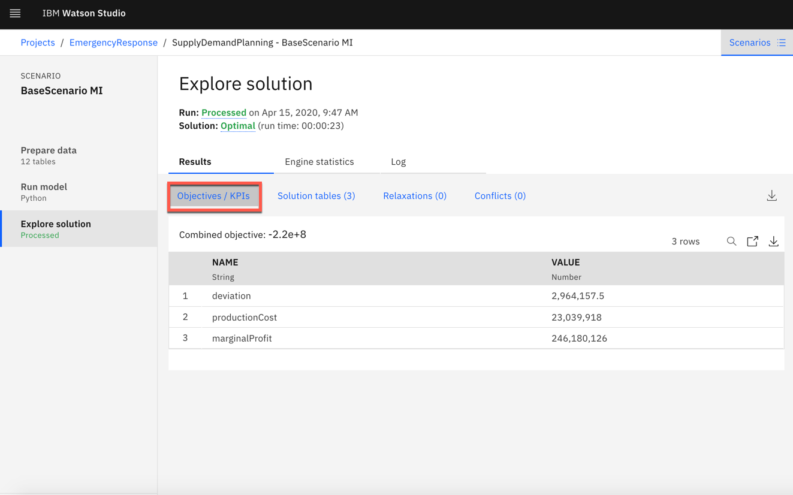
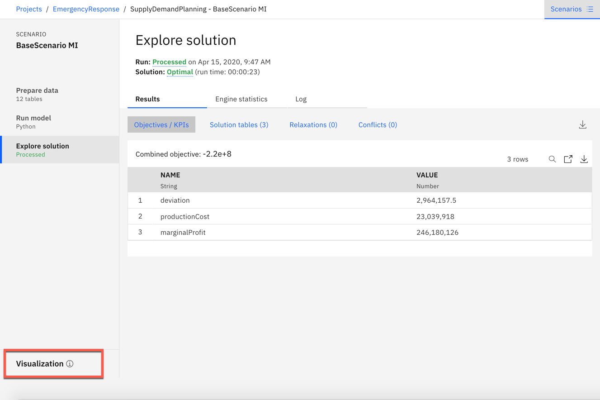
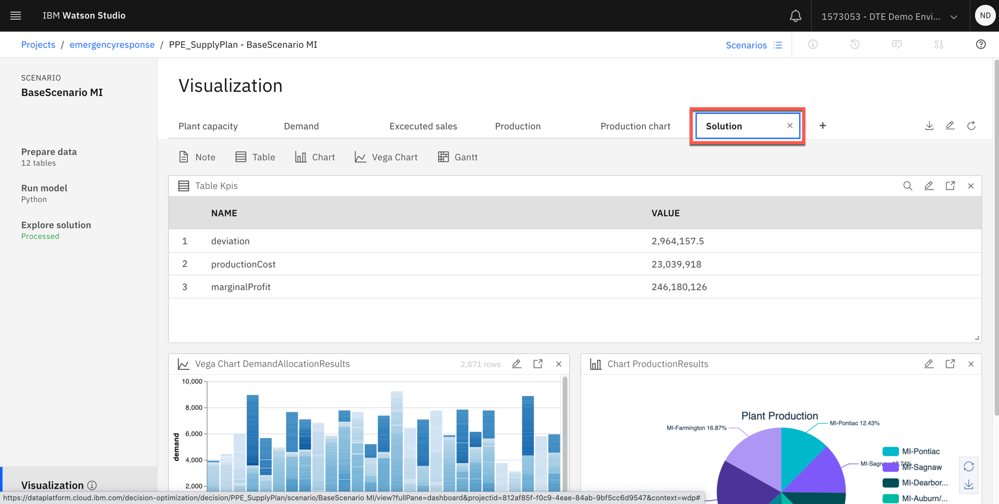
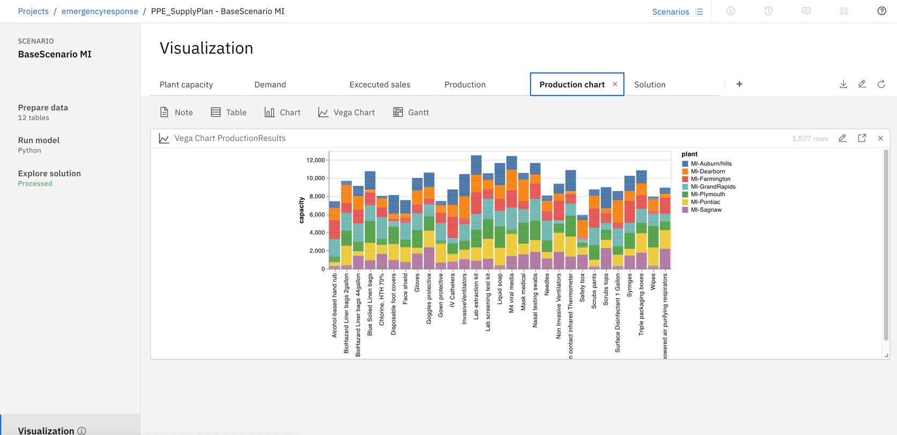

# Use Decision Optimization  to optimize availability PPE equipment based on COVID-19 data for Michigan counties

## Tutorial
Decision Optimization adds prescriptive analytics capabilities to IBM Watson Studio and IBM Watson Machine Learning. This hands-on lab is created around a simple Marketing Campaign problem. In 45 minutes, you set up a Watson Studio project and go through all the necessary steps to use Decision Optimization for Watson Studio and Decision Optimization for Watson Machine Learning.

In the previous 2 Tutorials we used the COVID-19 dataset to refine and predict cases using SPSS visual model building interface.Based on predictive model counties and other data we will use prescriptive analytics (optimization) to figure out what PPE equipment Michigan counties and hospitals would need to be prepared.

An optimization model defined in terms of
 - an objective, decision variables, and constraints
 - a optimization engine to solve the model instance
 - data to create an instance of the model

The purpose of the optimization process is to find values for the decision variables to satisfy all constraints and optimize the objective function

As an example, an objective function could be to maximize profit or to minimize costs. In our use case it is maximize allocation of PPE products
The decision variables might represent how many of different types of product to allocate based on importance and county requirements
or which county to assign these products and how much.

And the constraints could be the availability restrictions, fairness in allocation.

Optimization-based decision applications involve embedded optimization models and algorithms as part of larger applications that might include,
for example, a graphical user interface and integration with databases and other enterprise
systems.Such applications can be used to perform "what-if" analysis,where users can compare different scenarios, each involving different data.
By invoking the optimization model interactively and repeatedly, users can judge the impact of data changes, and analyze trade-offs between conflicting business goals and constraints.

In this tutorial, you will explore the following key capabilities:
 * You will learn how to build Optimization model
 * A model builder to guide developers through the typical optimization development steps
 * Dashboards for communicating the optimization model results

Required software, access, and files
To complete this lab, you will need:
• IBM Cloud Pak for Data
. IBM Watson Machine Learning Service

Acknowledgements

I would like to acknowledge the following team members for providing guidance with various parts of these tutorial
Xavier Ceugniet
Alain Chabrier
Victor Terpstra

You will also need to download and unzip the files in [Part3](https://github.com/neravdoshi/DSBlog/tree/master/Part3)

 We will be using decision optimization model builder for this tutorial. To learn more about model builder please click [here](https://www.ibm.com/support/producthub/icpdata/docs/content/SSQNUZ_current/do/DODS_Mdl_Assist/exhousebuildintro.html)

## Step

1. [Add a Decision Optimization to your Watson Studio Project](#1-Add-a-decision-optimization-to-your-watson-studio-project)
2. [Import the data required to build the model](#2-import-the-data-required-to-build-the-model)
3. [Run models and analyze results](#3-run-model-and-analyze-results)

### 1. Add a Decision Optimization to your Watson Studio Project

* Click on your newly created project.

* Once you have created your Watson Studio Project, you see a blue `Add to Project` button on the top-right corner of your screen.

* Click on `Add to Project` and then select `Decision Optimization Experiments`.Select Watson Machine Learning service from the dropdown menu.Note: If Watson Machine Learning service is not available then create a service using Lite plan

### 2. Import the data required to build the model
* Click the `Find and add data`. icon on the top right side and click on `browse`.as shown below

* Select all files and  Click `Open`. and import 5 input files required for building this model

Product.csv - This file contains product information. the columns in the file as follows
Product - name of the products
cost - cost to procure the products
qty_per_unit - number of product in 1 unit
unit_of_measure - metrics
importanceFactor - importance with respect to pandemic
required_qty_per_person - It is amount of product needed per patient/cases

ProductAvailability.csv - These file contains product that is available for entire state to be distributed to the counties.
Product - name of the products
Availability - Qty of units available for that time period

County.csv - This file is output from SPSS model where we are forecasting the number of potential cases for next 5 days
County - name of the County
forecasted_cases - no of forecasted new COVID cases
forecasted_death - no of forecasted deaths

CountyDemand.csv - This is the data collected from various counties with respected to their requirement for various products
County - name of the county
product - name of the product
demand - units of preoduct requested to be supplied

AllocationParameters - Budget allocated for the state

* Next, import files into model builder by selecting the files. Click `Import`.

### 3. Run model and analyze results
* Click on `Run model` on model builder and you will see 3 options to build optimization model. For this example we use the modeling assistant, Click `Use Modeling Assistant`

There are different decision domains currently available in the Modeling Assistant and you can be guided to choose the right domain for your problem. Documentation on different domains can be found [here](https://www.ibm.com/support/producthub/icpdata/docs/content/SSQNUZ_current/do/DODS_Mdl_Assist/mdl_asst_domains.html)

For this problem we will be using Selection and Allocation domain. Selection problems are about choosing from a list of possibilities. You can use the Selection and Allocation domain when you have combined all the possible choices. We would like to select the products(which are resources) for this model that we can allocate to counties.

* Click `Selection & Allocation` domain and it asks series of questions. It needs to understand which table to select the data. The first question asked is `What are the items (or combinations) to select from?` Click on `Choose a table` drop down menu and select `CountyDemand` table. The next question is around allocation. The modeling assistant needs to understand if this is just a selection problem or it is combination of selection and allocation. The question asked is `How do you want the selection to be made ?` Turn the toggle on to allocate quantities and Click `Continue`. This will now frame the modeling problem automatically. You will see a screen that shows `Select and allocate CountyDemands.` Click `Finish`

* Define Objectives - In this step we would like to define our Objectives.
The first thing we would like is to allocate as much product that we can to the counties. In the suggestion section one can freely write the objective in English as an natural language. We will type in `Maximize total CountyDemand allocations` and hit enter. This will then show the list of all possible suggestions related to the CountyDemand table. Click the `+` icon next to the suggested objective. You will see that the objective is moved to the left-hand side under Objectives

The second objective is to make the allocation fair with respect to demand. In the suggestion box type `Balance gap between allocation  and demand over CountyDemands` look at all the suggestions and pick the one that has the objective.

On the left-hand side when we formulated the objective the modeling assistant had already assumed an objective called `Maximize the total CountyDemand selections`. We don't need that so we can click the three dots next to it and it shows the options. Click `Remove`

[runProj](../images/Tutorial3-Step3-addObjectiveFunction.gif)

* Click on `Explore solution` on model builder and then look at the Objectives/KPI and Solutions tables link to review the output from optimization engine

* Click `Visualization` to review the pre-populated dashboard.

### Summary

This tutorial demonstrates a small example of creating a prescriptive optimization model on IBM Decision Optimization on Watson Studio(CPLEX engine). The tutorial goes over on importing the scenario into the project and running the model. The last step of the tutorial is about how to visualize and evaluate the results. You can see the total production required to meet demand. Based on cases you can allocate certain PPE equipemnt to counties that have high number of COVID cases.

* Next, select `From File` and `browse` to where you cloned this repository. Select the `Base Scenario MI.zip` file. Next, click `Create`.

