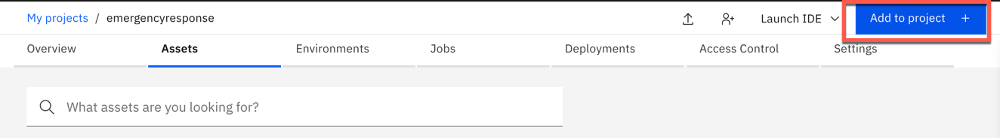
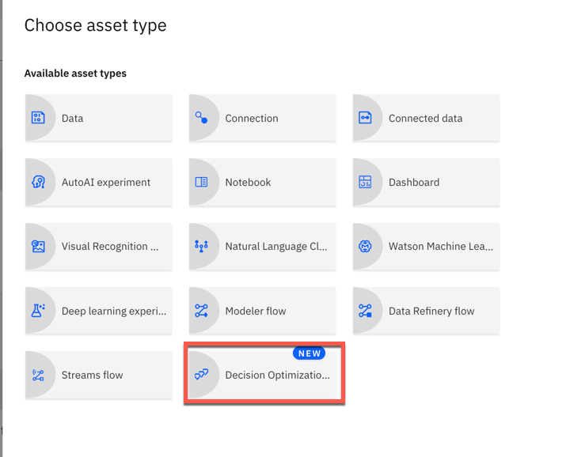
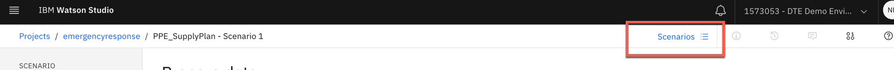
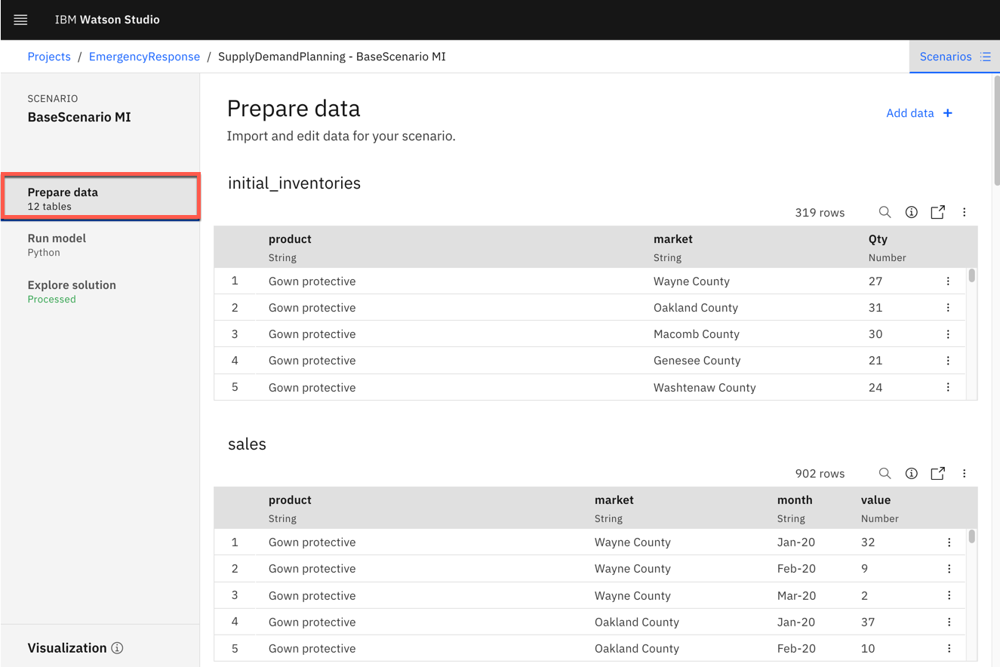

# Use Decision Optimization  to optimize availability PPE equipment based on COVID-19 data for Michigan counties

## Tutorial
Decision Optimization adds prescriptive analytics capabilities to IBM Watson Studio and IBM Watson Machine Learning. This hands-on lab is created around a simple Marketing Campaign problem. In 45 minutes, you set up a Watson Studio project and go through all the necessary steps to use Decision Optimization for Watson Studio and Decision Optimization for Watson Machine Learning.

In this tutorial, you will explore the following key capabilities:
 * You will learn how to build Optimization model
 * A model builder to guide developers through the typical optimization development steps
 * Dashboards for communicating the optimization model results

Required software, access, and files
To complete this lab, you will need:
• Watson Studio Cloud

You will also need to download and unzip the files in [Part3](https://github.com/neravdoshi/DSBlog/tree/master/Part3)

## Step

1. [Add a Decision Optimization to your Watson Studio Project](#1-Add-a-decision-optimization-to-your-watson-studio-project)
2. [Import the scenario and review data](#2-import-the-scenario-and-review-data)
3. [Run modle and analyze results](#3-run-model-and-analyze-results)

### 1. Add a Decision Optimization to your Watson Studio Project

* Click on your newly created project.

* Once you have created your Watson Studio Project, you see a blue `Add to Project` button on the top-right corner of your screen.

* Click on `Add to Project` and then select `Decision Optimization Experiments`.Select Watson Machine Learning service from the dropdown menu.Note: If Watson Machine Learning service is not available then create a service using Lite plan

### 2. Import the scenario and review data
* Click the `Scenarios`. icon on the right side as shown Below

* Next, select `From File` and `browse` to where you cloned this repository. Select the `Base Scenario MI.zip` file. Next, click `Create`.

* Click `Prepare data`. to look at tables that were imported. You can see product, plant, forecasted demand and market data along with other several tables.

### 3. Run model and analyze results
* Click on `Run model` on model builder and then look at the optimization code written in python.Next is Click the `Run model`. This will pass the input data and python model to CPLEX engine to provide recommendation

* Click on `Explore solution` on model builder and then look at the Objectives/KPI and Solutions tables link to review the output from optimization engine

* Click `Visualization` to review the pre-populated dashboard.

### Summary

This tutorial demonstrates a small example of creating a prescriptive optimization model on IBM Decision Optimization on Watson Studio(CPLEX engine). The tutorial goes over on importing the scenario into the project and running the model. The last step of the tutorial is about how to visualize and evaluate the results. You can see the total production required to meet demand. Based on cases you can allocate certain PPE equipemnt to counties that have high number of COVID cases.
